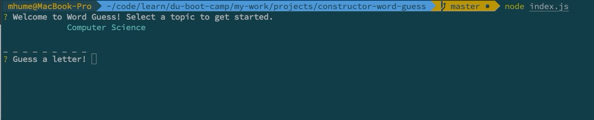
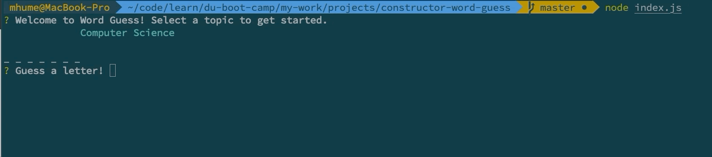

# Constructor Word Guess

## About
CLI based Word Guess game.

## Getting Started
1. Begin by typing the following code into the command line:
```
node index.js
```

2. Select a desired topic from which you will guess a word.


3. Type in a letter and then press enter.
*If you guessed correctly you will be notified and prompted to guess again.*



*If you guessed incorrectly you will be notified, shown the number of remaining guesses, and then prompted to guess again.*



*If you have already guessed that letter the app will notify you.*

4. Upon a win or loss you will be prompted to continue or quit.


## Built With
*   Node.js
*   npm packages
    * [inquirer](https://www.npmjs.com/package/inquirer)
    * [chalk](https://www.npmjs.com/package/chalk)


## Author
Mike Hume